# Parte II — Modelo entidade-relacionamento

## 14. Visão geral dos agregados

| Agregado      | Entidade raiz        | Entidades relacionadas                   |
| ------------- | -------------------- | ---------------------------------------- |
| Identidade    | `users`              | roles, permissions, sessions             |
| Cliente       | `customers`          | customer_limit_history                   |
| Catálogo      | `products`           | skus, product_images, price_history      |
| Estoque       | `inventory_balances` | locations, stock_movements               |
| Carrinho      | `carts`              | cart_items                               |
| Venda         | `orders`             | order_items                              |
| Faturamento   | `billing_periods`    | billing_entries, invoices, invoice_items |
| Pagamentos    | `payment_charges`    | payments, payment_events                 |
| Previsões     | `forecast_snapshots` | skus                                     |
| Processamento | `jobs`               | outbox_events                            |
| Auditoria     | `audit_logs`         | users                                    |

---

## 15. Diagrama entidade-relacionamento completo

```mermaid
erDiagram
    USERS {
        uuid id PK
        varchar name
        varchar email UK
        varchar phone
        varchar password_hash
        varchar status
        timestamp last_login_at
        timestamp created_at
        timestamp updated_at
    }

    ROLES {
        uuid id PK
        varchar code UK
        varchar name
    }

    PERMISSIONS {
        uuid id PK
        varchar code UK
        varchar name
    }

    USER_ROLES {
        uuid user_id PK, FK
        uuid role_id PK, FK
    }

    ROLE_PERMISSIONS {
        uuid role_id PK, FK
        uuid permission_id PK, FK
    }

    SESSIONS {
        uuid id PK
        uuid user_id FK
        varchar token_hash UK
        timestamp expires_at
        timestamp revoked_at
        inet ip_address
        text user_agent
        timestamp created_at
    }

    CUSTOMERS {
        uuid id PK
        uuid user_id FK, UK
        varchar document
        varchar status
        bigint credit_limit_cents
        bigint current_exposure_cents
        uuid approved_by FK
        timestamp approved_at
        text blocked_reason
        timestamp created_at
        timestamp updated_at
    }

    CUSTOMER_LIMIT_HISTORY {
        uuid id PK
        uuid customer_id FK
        bigint previous_limit_cents
        bigint new_limit_cents
        text reason
        uuid changed_by FK
        timestamp created_at
    }

    CATEGORIES {
        uuid id PK
        varchar name
        varchar slug UK
        boolean active
        timestamp created_at
        timestamp updated_at
    }

    PRODUCTS {
        uuid id PK
        uuid category_id FK
        varchar name
        varchar slug UK
        text description
        boolean active
        boolean visible
        timestamp created_at
        timestamp updated_at
    }

    SKUS {
        uuid id PK
        uuid product_id FK
        varchar code UK
        varchar barcode UK
        varchar unit
        bigint sale_price_cents
        bigint cost_price_cents
        integer minimum_stock
        boolean active
        timestamp created_at
        timestamp updated_at
    }

    PRODUCT_IMAGES {
        uuid id PK
        uuid product_id FK
        varchar storage_key
        integer position
        varchar alt_text
        timestamp created_at
    }

    PRICE_HISTORY {
        uuid id PK
        uuid sku_id FK
        bigint previous_price_cents
        bigint new_price_cents
        uuid changed_by FK
        text reason
        timestamp created_at
    }

    INVENTORY_LOCATIONS {
        uuid id PK
        varchar name
        boolean active
        timestamp created_at
    }

    INVENTORY_BALANCES {
        uuid id PK
        uuid location_id FK
        uuid sku_id FK
        integer available_quantity
        integer version
        timestamp updated_at
    }

    STOCK_MOVEMENTS {
        uuid id PK
        uuid location_id FK
        uuid sku_id FK
        varchar movement_type
        integer quantity
        integer previous_balance
        integer new_balance
        varchar reference_type
        uuid reference_id
        text reason
        uuid created_by FK
        timestamp created_at
    }

    CARTS {
        uuid id PK
        uuid customer_id FK
        varchar status
        timestamp created_at
        timestamp updated_at
    }

    CART_ITEMS {
        uuid id PK
        uuid cart_id FK
        uuid sku_id FK
        integer quantity
        timestamp created_at
        timestamp updated_at
    }

    ORDERS {
        uuid id PK
        varchar order_number UK
        uuid customer_id FK
        varchar status
        bigint subtotal_cents
        bigint discount_cents
        bigint total_cents
        uuid idempotency_key UK
        timestamp confirmed_at
        timestamp cancelled_at
        timestamp created_at
        timestamp updated_at
    }

    ORDER_ITEMS {
        uuid id PK
        uuid order_id FK
        uuid sku_id FK
        varchar product_name_snapshot
        varchar sku_code_snapshot
        bigint unit_price_cents
        integer quantity
        bigint total_cents
        timestamp created_at
    }

    ORDER_RETURNS {
        uuid id PK
        uuid order_id FK
        varchar status
        text reason
        uuid created_by FK
        timestamp created_at
        timestamp completed_at
    }

    ORDER_RETURN_ITEMS {
        uuid id PK
        uuid order_return_id FK
        uuid order_item_id FK
        integer quantity
        bigint credit_amount_cents
        boolean return_to_stock
    }

    BILLING_PERIODS {
        uuid id PK
        uuid customer_id FK
        integer reference_year
        integer reference_month
        varchar status
        timestamp opened_at
        timestamp closed_at
        timestamp created_at
        timestamp updated_at
    }

    BILLING_ENTRIES {
        uuid id PK
        uuid billing_period_id FK
        varchar entry_type
        uuid order_id FK
        uuid order_return_id FK
        text description
        bigint amount_cents
        timestamp occurred_at
        timestamp created_at
    }

    INVOICES {
        uuid id PK
        varchar invoice_number UK
        uuid customer_id FK
        uuid billing_period_id FK, UK
        varchar status
        bigint subtotal_cents
        bigint credit_cents
        bigint adjustment_cents
        bigint total_cents
        bigint paid_cents
        timestamp due_at
        timestamp closed_at
        timestamp paid_at
        timestamp created_at
        timestamp updated_at
    }

    INVOICE_ITEMS {
        uuid id PK
        uuid invoice_id FK
        uuid billing_entry_id FK
        text description
        integer quantity
        bigint unit_price_cents
        bigint total_cents
        timestamp created_at
    }

    BILLING_ADJUSTMENTS {
        uuid id PK
        uuid invoice_id FK
        varchar adjustment_type
        bigint amount_cents
        text reason
        uuid created_by FK
        timestamp created_at
    }

    PAYMENT_CHARGES {
        uuid id PK
        uuid invoice_id FK
        varchar provider
        varchar external_id
        varchar txid
        varchar status
        bigint amount_cents
        text qr_code_text
        varchar qr_code_image_key
        timestamp expires_at
        timestamp paid_at
        timestamp created_at
        timestamp updated_at
    }

    PAYMENTS {
        uuid id PK
        uuid invoice_id FK
        uuid payment_charge_id FK
        varchar provider
        varchar external_payment_id
        bigint amount_cents
        varchar status
        timestamp settled_at
        timestamp created_at
    }

    PAYMENT_EVENTS {
        uuid id PK
        varchar provider
        varchar external_event_id
        varchar event_type
        varchar payload_hash
        text payload_encrypted
        boolean processed
        timestamp processed_at
        text error_message
        timestamp created_at
    }

    BUSINESS_CALENDAR {
        date date PK
        varchar name
        varchar scope
        boolean is_business_day
        uuid created_by FK
        timestamp created_at
        timestamp updated_at
    }

    FORECAST_SNAPSHOTS {
        uuid id PK
        uuid sku_id FK
        date reference_month
        integer forecast_quantity
        integer safety_stock_quantity
        integer suggested_purchase_quantity
        varchar confidence_level
        varchar method
        jsonb parameters
        timestamp created_at
    }

    JOBS {
        uuid id PK
        varchar type
        jsonb payload
        varchar status
        integer attempts
        timestamp available_at
        timestamp locked_at
        varchar locked_by
        text last_error
        timestamp created_at
        timestamp completed_at
    }

    OUTBOX_EVENTS {
        uuid id PK
        varchar event_type
        varchar aggregate_type
        uuid aggregate_id
        jsonb payload
        varchar status
        integer attempts
        timestamp available_at
        timestamp processed_at
        text last_error
        timestamp created_at
    }

    AUDIT_LOGS {
        uuid id PK
        uuid actor_user_id FK
        varchar action
        varchar entity_type
        uuid entity_id
        uuid request_id
        jsonb old_values
        jsonb new_values
        inet ip_address
        timestamp created_at
    }

    USERS ||--o{ USER_ROLES : has
    ROLES ||--o{ USER_ROLES : assigned
    ROLES ||--o{ ROLE_PERMISSIONS : grants
    PERMISSIONS ||--o{ ROLE_PERMISSIONS : included
    USERS ||--o{ SESSIONS : opens

    USERS ||--o| CUSTOMERS : represents
    USERS ||--o{ CUSTOMERS : approves
    CUSTOMERS ||--o{ CUSTOMER_LIMIT_HISTORY : has
    USERS ||--o{ CUSTOMER_LIMIT_HISTORY : changes

    CATEGORIES ||--o{ PRODUCTS : classifies
    PRODUCTS ||--o{ SKUS : contains
    PRODUCTS ||--o{ PRODUCT_IMAGES : displays
    SKUS ||--o{ PRICE_HISTORY : records
    USERS ||--o{ PRICE_HISTORY : changes

    INVENTORY_LOCATIONS ||--o{ INVENTORY_BALANCES : contains
    SKUS ||--o{ INVENTORY_BALANCES : stocked
    INVENTORY_LOCATIONS ||--o{ STOCK_MOVEMENTS : receives
    SKUS ||--o{ STOCK_MOVEMENTS : moves
    USERS ||--o{ STOCK_MOVEMENTS : creates

    CUSTOMERS ||--o{ CARTS : owns
    CARTS ||--o{ CART_ITEMS : contains
    SKUS ||--o{ CART_ITEMS : selected

    CUSTOMERS ||--o{ ORDERS : places
    ORDERS ||--|{ ORDER_ITEMS : contains
    SKUS ||--o{ ORDER_ITEMS : references
    ORDERS ||--o{ ORDER_RETURNS : may_have
    ORDER_RETURNS ||--|{ ORDER_RETURN_ITEMS : contains
    ORDER_ITEMS ||--o{ ORDER_RETURN_ITEMS : returned
    USERS ||--o{ ORDER_RETURNS : creates

    CUSTOMERS ||--o{ BILLING_PERIODS : has
    BILLING_PERIODS ||--o{ BILLING_ENTRIES : contains
    ORDERS ||--o{ BILLING_ENTRIES : generates
    ORDER_RETURNS ||--o{ BILLING_ENTRIES : credits
    BILLING_PERIODS ||--o| INVOICES : closes_into
    CUSTOMERS ||--o{ INVOICES : receives
    INVOICES ||--|{ INVOICE_ITEMS : contains
    BILLING_ENTRIES ||--o| INVOICE_ITEMS : becomes
    INVOICES ||--o{ BILLING_ADJUSTMENTS : receives
    USERS ||--o{ BILLING_ADJUSTMENTS : creates

    INVOICES ||--o{ PAYMENT_CHARGES : charged_by
    PAYMENT_CHARGES ||--o{ PAYMENTS : settles
    INVOICES ||--o{ PAYMENTS : receives

    USERS ||--o{ BUSINESS_CALENDAR : configures
    SKUS ||--o{ FORECAST_SNAPSHOTS : forecasted

    USERS ||--o{ AUDIT_LOGS : performs
```



---

# 16. Restrições e índices fundamentais

## 16.1. Restrições únicas

```sql
UNIQUE (users.email);
UNIQUE (roles.code);
UNIQUE (permissions.code);
UNIQUE (products.slug);
UNIQUE (skus.code);
UNIQUE (skus.barcode);
UNIQUE (inventory_balances.location_id, inventory_balances.sku_id);
UNIQUE (billing_periods.customer_id, reference_year, reference_month);
UNIQUE (invoices.billing_period_id);
UNIQUE (orders.idempotency_key);
UNIQUE (payment_events.provider, payment_events.external_event_id);
UNIQUE (payment_charges.provider, payment_charges.external_id);
UNIQUE (payment_charges.provider, payment_charges.txid);
```

## 16.2. Restrições de validação

```sql
CHECK (credit_limit_cents >= 0);
CHECK (current_exposure_cents >= 0);
CHECK (sale_price_cents >= 0);
CHECK (cost_price_cents IS NULL OR cost_price_cents >= 0);
CHECK (minimum_stock >= 0);
CHECK (available_quantity >= 0);
CHECK (quantity > 0);
CHECK (subtotal_cents >= 0);
CHECK (discount_cents >= 0);
CHECK (total_cents >= 0);
CHECK (paid_cents >= 0);
CHECK (reference_month BETWEEN 1 AND 12);
```

## 16.3. Índices iniciais

```sql
CREATE INDEX idx_products_category_active
ON products(category_id, active, visible);

CREATE INDEX idx_skus_product_active
ON skus(product_id, active);

CREATE INDEX idx_stock_movements_sku_created
ON stock_movements(sku_id, created_at DESC);

CREATE INDEX idx_orders_customer_created
ON orders(customer_id, created_at DESC);

CREATE INDEX idx_orders_status_created
ON orders(status, created_at DESC);

CREATE INDEX idx_billing_period_customer_reference
ON billing_periods(customer_id, reference_year, reference_month);

CREATE INDEX idx_invoices_customer_status
ON invoices(customer_id, status);

CREATE INDEX idx_invoices_due_status
ON invoices(due_at, status);

CREATE INDEX idx_payment_charges_invoice_status
ON payment_charges(invoice_id, status);

CREATE INDEX idx_payment_events_processed_created
ON payment_events(processed, created_at);

CREATE INDEX idx_jobs_status_available
ON jobs(status, available_at);

CREATE INDEX idx_outbox_status_available
ON outbox_events(status, available_at);

CREATE INDEX idx_audit_entity_created
ON audit_logs(entity_type, entity_id, created_at DESC);
```

---